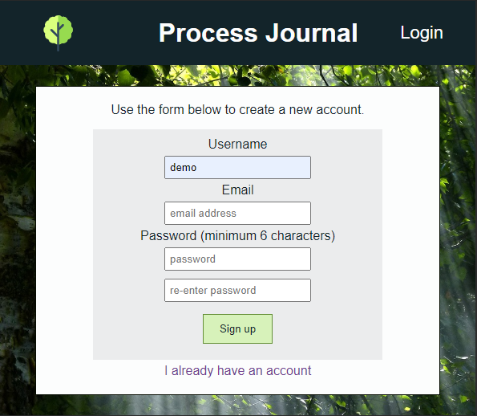
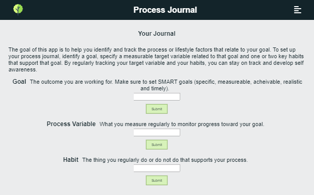
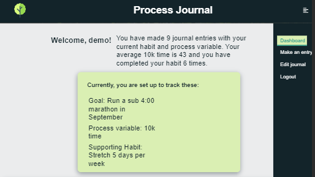
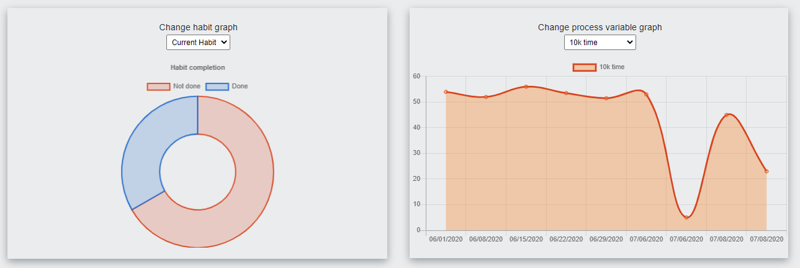
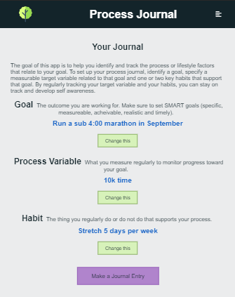
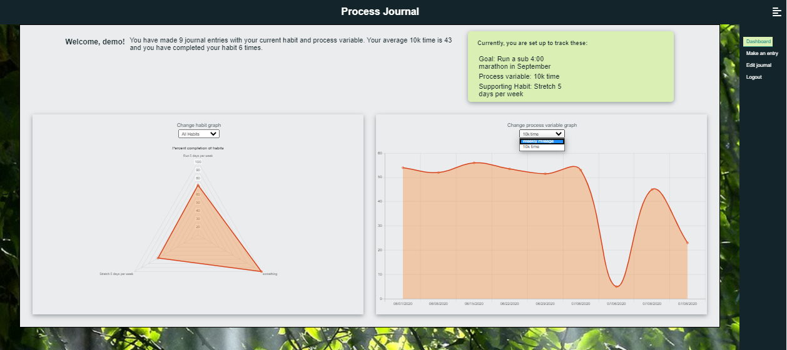

# Process Journal # 

An interactive web application for setting goals and tracking progress. This application is based on the premise that in order to acheive long term goals, you should focus on maintaining good habits related to your goal as well as tracking measurable steps toward your goal.

Live application: [https://process-journal-client.vercel.app/](https://process-journal-client.vercel.app/)

## User Flows ##

#### Create an Account #### 

#### Set up a Custom Journal ####

#### Make Daily Journal Entries to Current Custom Journal ####

#### Monitor Progress in Journal Dashboard ####

#### Edit the Custom Journal to Track New Goals, Habits and Variables ####

#### View Past Journal Data ####

## Technologies: ##
Process Journal is a full-stack web application. The client is hosted on Vercel and the server and database are hosted on Heroku. Here's the stack:

Front end
HTML5/CSS3/JS
- React

Back end
- Node
- Express
- PostgreSQL

Check out the [Process-Journal API](https://github.com/kim-mccallum/process-journal-api) for more info. 

Misc.
- ChartJS
- React Router
- Knex
- JWT
- Mocha / Chai / Supertest
- Morgan / CORS / Helmet
