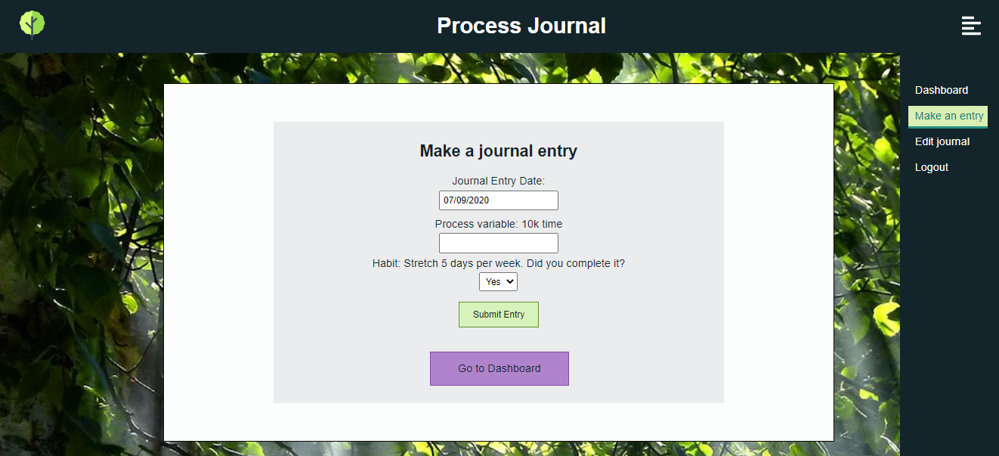

# Process Journal Client

An interactive web application for setting goals and tracking progress. This application is based on the premise that in order to acheive long term goals, you should focus on maintaining good habits related to your goal as well as tracking measurable steps toward your goal.

Live application: [https://process-journal-client.vercel.app/](https://process-journal-client.vercel.app/)

## User Flows

#### Create an Account

#### Set up a Custom Journal

#### Make Daily Journal Entries to Current Custom Journal

#### Monitor Progress in Journal Dashboard

#### Edit the Custom Journal to Track New Goals, Habits and Variables

#### View Past Journal Data

## Technologies:

Process Journal is a full-stack web application. The client is hosted on Vercel and the server and database are hosted on Heroku. Here's the stack:

Front end
HTML5/CSS3/JS

- React

Back end

- Node
- Express
- PostgreSQL

Check out the [Process-Journal API](https://github.com/kim-mccallum/process-journal-api) for more info.

Misc.

- ChartJS
- React Router
- Knex
- JWT
- Mocha / Chai / Supertest
- Morgan / CORS / Helmet

## About the Process Journal API

This API services the Process Journal React client application and comprises an Express server coupled with a PostgreSQL database. The database stores user information from the process journal client. This server has authentication endpoints for creating an account, logging in and access user journal data such as user goals, process variables, habits and journal entries. Passwords are securely hashed and stored and authentication is handled using JWT.

A typical request pattern looks like this:

- A user visits the Process Journal client application, creates an account and makes a POST request to store their username, email and hashed password in the database.
- A user logs in by submitting a POST request to the login endpoint. Their hashed password is compared to the database and if valid, a token is returned to the client.
- As users interact with the app, they make repeated POST and GET requests to the protected endpoints: `api/goal`, `api/process_variable`, `api/habit`, `api/goal/current`, `api/process_variable/current`, `api/habit/current` and `api/entries` endpoints. Requests are validated, responses are sent accordingly and the user data is returned and rendered in the UI.

## Scripts

Start the application `npm start`

Start nodemon for the application `npm run dev`

Run the tests `npm test`

## Deploying

When this project is ready to be updated and redeployed, simply run `npm run build` and then `npm run deploy` which will push to this remote's master branch.
